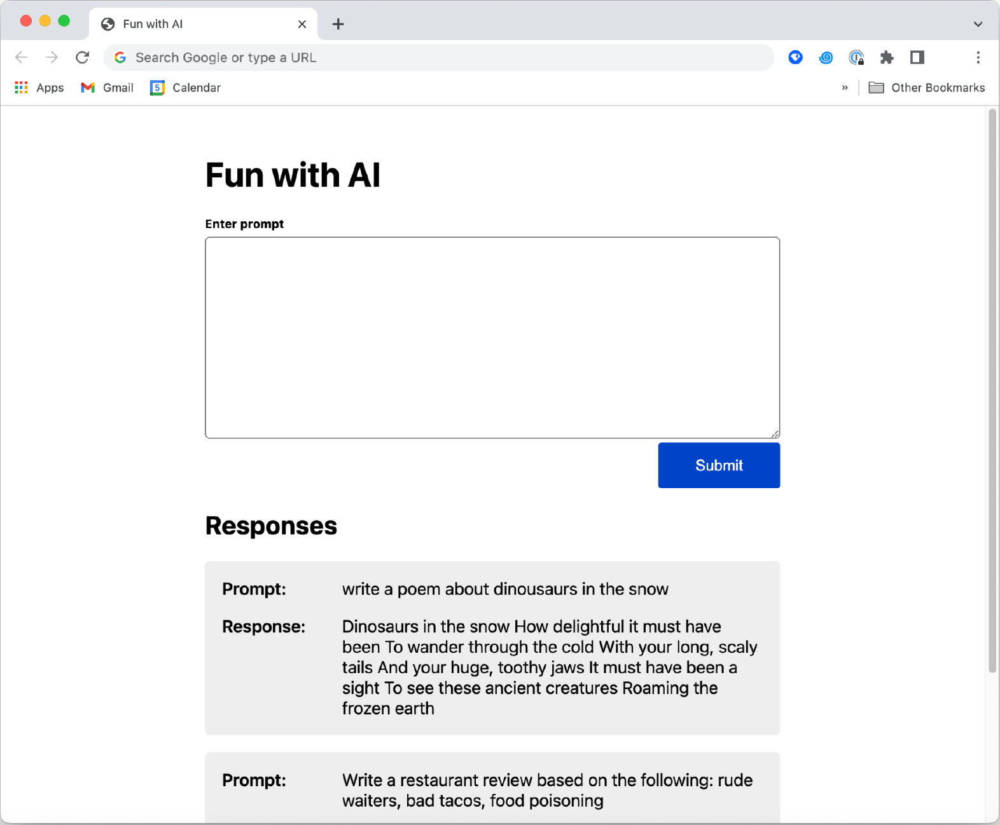

## Frontend Intern Shopify Challenge - Fall 2022
[](https://app.netlify.com/sites/ashleytran-shopify-frontend-challenge-fall2022/deploys)

---
Status: 🚫 rejected :) <br>
Library: ReactJS <br>
Styling: Bulma framework <br>
Handle data using: react state hook, async fetch func <br>
Deployed at: https://ashleytran-shopify-frontend-challenge-fall2022.netlify.app/ <br>
Note: not handling empty input submit for submit-button because using [OpenAI Text Completion API](https://beta.openai.com/docs/guides/completion/prompt-design) (the API generates random completed sentence(s) for an empty input) instead handling loading-button to prevent user clicking again while the form is being submitted to the API and is waiting for response to comeback (init submission takes longer time to response)

### Local Setup
1. Install dependencies with `npm i`.
2. Using your own OpenAI account: create `.env` file with this format in the file `REACT_APP_OPENAI_API_KEY='your-api-key'`
3. Run `npm start` -> visit `http://localhost:3000/`

### Demo


### The Challenge - Fun with GPT-3
GPT-3 is a powerful AI model created by [OpenAI](https://openai.com/api/). It can process plain text prompts and produce outputs that are hard to distinguish from human writing. Check out some [examples](https://beta.openai.com/examples/) of what it can do! GPT-3 can be accessed through a public API that includes a generous amount of free credits. <br>
You will write an app that sends plain text prompts to the OpenAI API and displays the results in a list. We'd like your app to have a simple-to-use interface that includes the following:
- A form for entering text prompts - ✅ implemented
- Submitting the form sends the prompt to the OpenAI API - ✅ implemented
- Results are displayed in a list, sorted from newest to oldest. Each result should include the original prompt and a response from the API  - ✅ implemented

### Techical requirements
1. Results should come from OpenAI’s completions API, for which you’ll need a free API key (no credit card required). Detailed signup instructions are [included below](#openai-sign-up-instructions) - ✅ implemented
    - We’ve provided screenshots below of demo apps we built using the OpenAI API.
    - We recommend using the “text-curie-001” AI engine which is a good balance between speed, cost, and accuracy ([example code below](#example-js-code-for-sending-requests))
    - You are free to use any front end framework/component library you like (or none at all!)
2. Each result should include at least the original prompt you entered and the response from the API - ✅ implemented
3. Responses should be stored in order of newest to oldest - ✅ implemented
4. The HTML that ends up being served client-side should be accessible and semantic ([MDN reference](https://developer.mozilla.org/en-US/docs/Learn/Accessibility/HTML)) - ✅ implemented

#### Example Screenshot


### Extras - did not go extra ⚰️
<small>There is a lot to be improved on here, you can polish the required features by crafting a nicer design, or improve the app by adding new features! Choose something that you feel best showcases your passion and skills. <br>
If you need inspiration, here are examples of what you can work on. If you work on these ideas, <strong>we recommend choosing only one or two.</strong>
- Save responses if the user leaves or reloads the page
- Let the user choose the AI engine from a select box
- Add some presets for the user to quickly send a good prompt
- Make the app more specific to a single purpose. See the [OpenAI examples](https://beta.openai.com/examples/) and [prompt design docs](https://beta.openai.com/docs/guides/completion/prompt-design) for inspiration.
</small>

### Submission
Please submit your application via “Apply Now” and make sure you include:
- A link to your hosted code so we can test it (Free hosting available via: [Cloudflare Pages](https://developers.cloudflare.com/pages/get-started/), [CodeSandbox](https://dev.to/codergirl1991/how-to-use-codesandbox-a-beginners-guide-1akl), [Github pages](https://pages.github.com), [Netlify](https://www.netlify.com/blog/2016/09/29/a-step-by-step-guide-deploying-on-netlify/) and [Heroku](https://devcenter.heroku.com/start)) - ✅ with Netlify
  - Quick start guides for each hosting site have been linked above
- A link to your Github repository containing the code - ✅ added
- Any other notes you'd like us to consider alongside the page - ✅ added

---
## OpenAI sign up instructions
1. Go to https://beta.openai.com/signup
2. Enter your email address and password
3. Verify your email address
4. Verify your phone number by entering the code that is sent to you via SMS
5. Once logged in, go to https://beta.openai.com/account/api-keys to get your secret API key

Once you have your secret API key you can send requests from your application. Please note that you have $18.00 of free credits - consider using a [less expensive model](https://openai.com/api/pricing/) such as <strong>“text-curie-001”</strong> to ensure that you don’t exceed the limit.

<strong>Important: You should never expose API keys on the client side in production code because anyone on the internet will have access to your secret key and can make
requests with your account. It is however acceptable for the purpose of this application and testing since it won’t be widely available and we don’t expect you to have a backend
server. </strong><br>
You should consider using environment variables or a key manager to avoid committing your
secret API key to your git repository. Check the documentation for your hosting provider for how to do this. <br>

#### Example JS code for sending requests:
```js
  const data = {
    prompt: "Write a poem about a dog wearing skis",
    temperature: 0.5,
    max_tokens: 64,
    top_p: 1.0,
    frequency_penalty: 0.0, 
    presence_penalty: 0.0,
  };

  fetch("https://api.openai.com/v1/engines/text-curie-001/completions", {
    method: "POST,
    headers: {
      "Content-Type": "application/json",
      Authorization: `Bearer ${process.env.OPENAI_SECRET}`,
    },
    body: JSON.stringify(data),
  });
```


